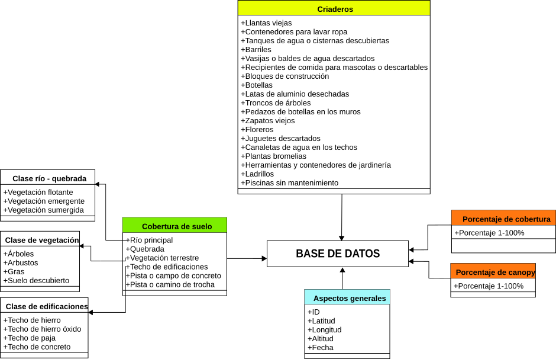
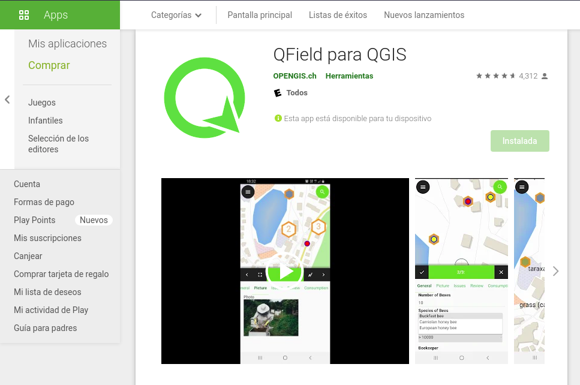
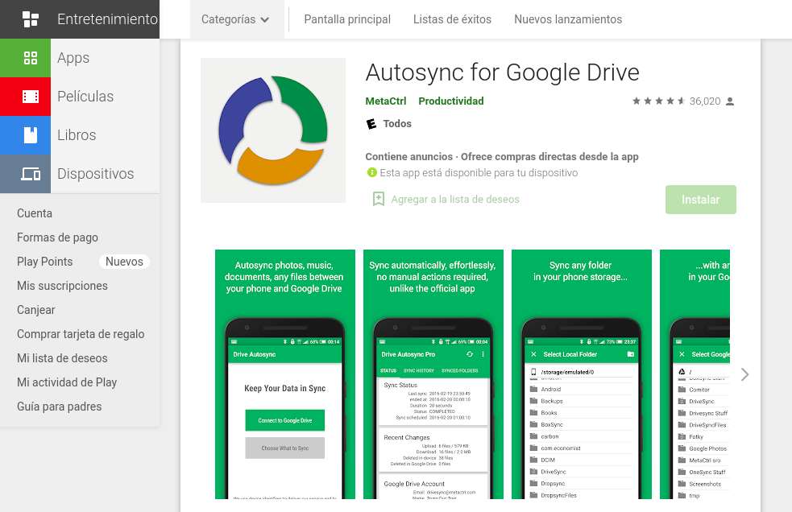

<h1 align="center"><b>QFIELD-UPCH</b></h1>

    

-----

## **Estructura del formulario**

-----
## **Características**
<table class="default" align="center">
  <tr>
    <td><b>Sistema operativo</b></td>
    <td><b>Software</b></td>
    <td><b>Pulgin</b></td>
    <td><b>Base de datos</b></td>
  </tr>
  <tr>
    <td>Pop! OS 21.04 (hirsute)</td>
    <td>QGIS 3.20.1-Odense</td>
    <td>QField Sync</td>
    <td>Geopackages</td>
  </tr>
</table>

-----

## **Aplicaciones para el trabajo de campo**
<table align="center">
 <tr>
  <th>
QField para QGIS
</th>
  <th>
Autosync for Google drive
</th>
 </tr>
 <tr>
  <td align="center">
   <a href="https://play.google.com/store/apps/details?id=ch.opengis.qfield&hl=es_PE&gl=US">
    
      
     
     <b>Download</b>
     
    </a>
   </td>
  <td align="center">
   <a href="https://play.google.com/store/apps/details?id=com.ttxapps.drivesync&hl=es_PE&gl=US">
    
      
     
     <b>Download</b>
     
    </a>
  </td>
 </tr>
</table>
